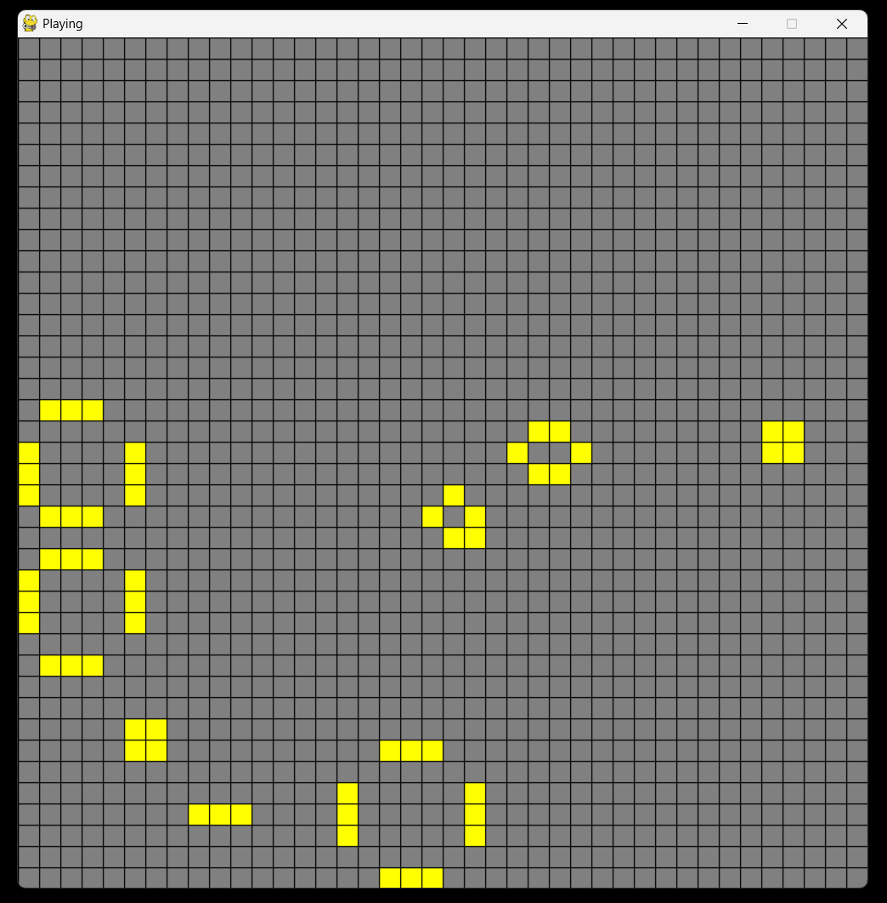

# Life-Simulation-
Using Conway's game of life simulation to help with my python coding practice.

# What is Conway's Game of Life?

Conway's Game of Life is like a simulation game where you start with a pattern of cells on a grid. Some cells are "alive," others "dead." Each round, these cells change based on simple rules: a cell comes to life if it has three alive neighbors, stays alive with two or three neighbors, but dies if it's lonely or crowded. This creates fascinating patterns over time, almost like a tiny universe evolving. 

# Python libraries Used

# 1. Pygame
**Usage:** Pygame is a set of Python modules designed for writing video games. It includes computer graphics and sound libraries. In the project, Pygame is used for rendering the game's graphical interface, handling events (like keyboard and mouse inputs), and managing the game's main loop.

**Key Functions in my Project:**
pygame.init(): Initializes all the Pygame modules.
pygame.display.set_mode(): Sets up the window or screen for display.
pygame.draw.rect(), pygame.draw.line(): Used for drawing the grid and cells.
pygame.event.get(): Handles events, like mouse clicks and keyboard presses.
pygame.time.Clock(): Manages the frames per second (FPS) and game time.

# 2. Random
**Usage**: The Random module is part of Python's standard utility modules. It is used to generate pseudo-random numbers. In this project, this module is crucial for creating an initial random distribution of alive and dead cells on the grid.

**Key Functions in my Project:**
random.randrange(): Generates a random number within a specified range. It's used in the gen(num) function to place a certain number of cells randomly on the grid.

# 3. PyInstaller
**Usage:** PyInstaller is a library used to convert Python applications into stand-alone executables, under Windows, macOS, Linux, and other common operating systems. By using PyInstaller, you can bundle your Python script and all its dependencies into a single executable file, making it easier to distribute and run on systems without requiring a separate Python installation.

**Key Function in my Project:**
Bundling the Game: PyInstaller was used to convert my Conway's Game of Life Python script into an .exe file. This allows users to run the game as a standalone application without needing to install Python or any dependencies. The executable file can also be downloaded from the repo.

# A Screenshoot of the game in action 

